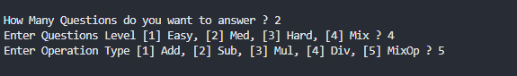

# 🧮 Math Game

A console-based Math Game implemented in C++.

## Overview

The game generates random math questions based on the selected question level and operation type, checks the player's answers, and shows the final result at the end.

## Features

- Multiple questions in one round
- Random question generation
- Different question levels
- Different operation types
- Colored console output
- Final game statistics
- Play again option
- Clean and organized code using `struct`, `enum`, arrays, and functions

## Concepts Used

- Functions
- Structs
- Enums
- Arrays
- Loops
- Random Number Generation
- Switch Statements
- Pass by Reference
- Console Programming

## Project Structure

```text
Math-Game
│
├── main.cpp
├── README.md
├── LICENSE
└── Screenshots
    ├── Game-Start.png
    ├── Correct Answer.png
    ├── Wrong Answer.png
    ├── Final Result - Pass.png
    └── Final Result - Fail.png
```

## Screenshots

### Game Start



### Correct Answer


### Wrong Answer


### Final Result - Pass


### Final Result - Fail


## Language

C++

## Author

Ahmed Hamdy